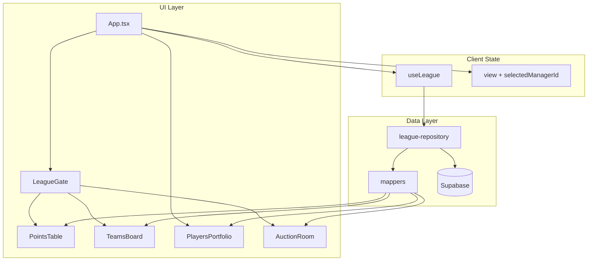

# WC26 Fantasy Auction — Application Structure

Complete reference for the current frontend app: architecture, files, data flow, UI, and what is implemented vs. placeholder.

---

## Overview

| Item | Detail |
|------|--------|
| **Product** | World Cup 2026 Fantasy Auction dashboard |
| **League model** | 8 franchises, custom draft / auction, **Total Asset Accumulation Portfolio** scoring |
| **Stack** | Next.js 15, React 19, TypeScript, Tailwind CSS 4, Motion, Three.js (R3F), Supabase |
| **Runtime** | Next.js App Router (`app/`) — deploy on Vercel |
| **Data** | Supabase PostgreSQL — see [DATABASE.md](./DATABASE.md) |
| **Port** | `3000` (`npm run dev`) |

---

## Repository layout

```
World-cup-Auction/
├── app/
│   ├── layout.tsx              # Root layout, fonts, metadata
│   ├── page.tsx                # Home → Dashboard
│   └── globals.css             # Tailwind v4 theme
├── src/
│   ├── components/
│   │   ├── Dashboard.tsx       # Main shell (nav, views, drawer)
│   │   └── …
│   ├── hooks/
│   ├── lib/
│   └── types.ts
├── next.config.ts
├── postcss.config.mjs
└── supabase/migrations/
```

---

## High-level architecture



1. **`useLeague`** runs on mount and exposes `leagueData`, `loading`, `error`, `reload()`.
2. **`fetchLeague`** loads `teams` with nested `players` and `team_point_history`.
3. **Mappers** convert DB rows into `Manager[]` (sorted by `totalPoints`).
4. **Components** are presentational: they receive `leagueData` as props (no direct Supabase calls in UI).

---

## Environment

| Variable | Required | Purpose |
|----------|----------|---------|
| `NEXT_PUBLIC_SUPABASE_URL` | Yes | Supabase project URL |
| `NEXT_PUBLIC_SUPABASE_ANON_KEY` | Yes | Public anon key for browser reads |

Defined in `.env.local` locally, or Vercel **Environment Variables** in production.

**Security:** Only the **anon** key belongs in the frontend. Never put the service role key in `NEXT_PUBLIC_*` variables.

---

## Domain types (`src/types.ts`)

### `Position`

`'GK' | 'DEF' | 'MID' | 'FWD'`

### `Tier`

`'gold' | 'silver' | 'bronze'`

### `Player`

| Field | Type | Source |
|-------|------|--------|
| `id` | `string` | DB `players.id` (UUID) |
| `name` | `string` | DB |
| `country` | `string` | DB (e.g. `ARG`, `FRA`) |
| `position` | `Position` | DB |
| `points` | `number` | DB — fantasy yield |
| `tier` | `Tier` | DB |
| `price` | `number?` | DB `price_m` — auction spend (millions) |

### `Manager` (franchise in UI)

| Field | Type | Source / rule |
|-------|------|----------------|
| `id` | `string` | DB `teams.id` |
| `name` | `string` | DB `manager_name` |
| `teamName` | `string` | DB `team_name` |
| `budgetTotal` | `number` | DB `budget_total` (millions) |
| `totalPoints` | `number` | **Computed:** sum of `roster[].points` |
| `pointsLast24h` | `number` | DB `points_last_24h` |
| `history` | `number[]` | DB `team_point_history` → padded/sliced for sparkline |
| `squadCount` | `number` | **Computed:** `roster.length` |
| `roster` | `Player[]` | DB nested `players` |
| `topAsset` | `Player` | **Computed:** highest points; prefer `gold` tier |

### League constants (`src/config/constants.ts`)

| Constant | Value | Meaning |
|----------|-------|---------|
| `SQUAD_SIZE` | `30` | Max roster size shown in UI |
| `DEFAULT_BUDGET_M` | `200` | Fallback purse (millions) |
| `PLACEHOLDER_SLOT_COST_M` | `12.5` | Estimated cost per filled slot if no `price` set |
| `ROSTER_QUOTAS` | 2 GK, 10 DEF, 10 MID, 8 FWD | Target composition (documentation / future validation) |

---

## Navigation & views

There is **no URL router**. View state lives in `App.tsx`:

```ts
type ViewState = 'points-table' | 'teams' | 'players' | 'auction';
```

| Tab label | `view` value | Component | Notes |
|-----------|--------------|-------------|-------|
| Standings | `points-table` | `PointsTable` | Default on load |
| Franchises | `teams` | `TeamsBoard` | Grid of 8 cards |
| Live Auction | `auction` | `AuctionRoom` | Smoke shader background |
| **Admin** | `admin` | `AdminPage` | Add franchises (outside `LeagueGate`) |
| *(drawer)* | `players` | `PlayersPortfolio` | Overlay; `teams` board still mounted underneath |

**Logo click** → Standings, clears selected team.

**Reload League** → calls `reload()` → re-fetches Supabase.

---

## Component reference

### `AdminPage` / `AddTeamForm`

- Nav **Admin** button.
- Form: manager name, franchise name, budget (default 200M).
- Writes via `teams-repository.createTeam()`; auto `sort_order`.
- Max 8 teams; list of current franchises on the right.

### `App.tsx`

- Full-screen black layout, film-grain overlay, sticky nav (WC26 logo).
- `VercelGridBg`: switches `WC26GeometryCanvas` vs `AuctionSmokeCanvas`.
- Wraps main content in `LeagueGate`.
- Player drawer: fixed right panel + backdrop (`AnimatePresence`).

### `LeagueGate.tsx`

| State | UI |
|-------|-----|
| `loading` | Spinner + “Loading league” |
| `error` | Message + Retry (misconfigured `.env` or Supabase error) |
| Empty `leagueData` | Hint to add `teams` / `players` in Supabase |
| Success | Renders children |

### `PointsTable.tsx`

- Leaderboard rows: rank, team name, manager name, sparkline, Sync Flow (`pointsLast24h`), Total points.
- “Top Mover” badge when `pointsLast24h` equals league max and &gt; 0.
- `layout` animations on reorder (after reload / point changes).
- `data-premium="true"` on top 3 rows (shader hover effect).

### `TeamsBoard.tsx`

- Responsive grid (1 / 2 / 4 columns).
- Card: team name, manager, yield total, capacity `squadCount/30`, top asset.
- Click → `onSelectTeam(id)` → opens drawer.

### `PlayersPortfolio.tsx`

- Slide-over roster grouped by position.
- Tier styling (gold / silver / bronze borders and badges).
- Back button closes drawer.

### `AuctionRoom.tsx`

| Area | Status |
|------|--------|
| Remaining budgets | **Live** — uses `leagueData` + `getBudgetRemainingM()` |
| Current lot, bids, up next, sold | **Mock** — hardcoded assets; leading team uses `leagueData[0]` |
| Bid blink animation | Cosmetic interval |

Props: `{ leagueData: Manager[] }`.

### Visual / effects

| Component | Tech | Role |
|-----------|------|------|
| `WC26GeometryCanvas` | R3F + custom GLSL | Animated grid; mouse + `[data-premium]` hover |
| `AuctionSmokeCanvas` | R3F + FBM smoke shader | Auction tab only |
| `SplitText` | Motion | Per-character title reveal |
| `AnimatedNumber` | Motion | Point value transitions |

### `src/lib/budget.ts`

```text
If any player has price → remaining = budgetTotal - sum(prices)
Else → remaining = budgetTotal - squadCount × 12.5
```

---

## Data flow (read path)

```text
Supabase teams (+ players + team_point_history)
    → league-repository.fetchLeague()
    → mappers.mapTeamsToLeague()
    → Manager[] sorted by totalPoints
    → useLeague state
    → Props to PointsTable | TeamsBoard | PlayersPortfolio | AuctionRoom
```

**Not persisted from UI:** standings refresh only re-reads DB; there is no write API in the app yet.

---

## Styling

- **Theme:** Dark (`#000` / `#EDEDED`), Vercel-inspired grid, glass borders `white/[0.08]`.
- **Fonts** (Google Fonts in `index.css`): Inter (sans), JetBrains Mono (mono), Space Grotesk (display).
- **Tailwind v4:** `@import "tailwindcss"` + `@theme` font tokens.
- **Utilities:** `cn()` in `lib/utils.ts` for conditional classes.

---

## Scripts

| Command | Action |
|---------|--------|
| `npm run dev` | Dev server :3000 |
| `npm run build` | Output to `dist/` |
| `npm run preview` | Preview production build |
| `npm run lint` | `tsc --noEmit` |
| `npm run clean` | Remove `dist/` |

---

## Implemented vs. planned

| Feature | Status |
|---------|--------|
| Load teams & players from Supabase | Done |
| Standings / franchises / roster UI | Done |
| Loading, error, empty states | Done |
| Reload from DB | Done |
| Admin page — add teams | Done (`Admin` nav → form writes to `teams`) |
| Admin — add players | Not built |
| Real auction state / bidding | UI mock only |
| Real scoring ingestion (matches) | Manual via DB `points` |
| Auth (commissioner vs manager) | Not built |
| Next.js on Vercel | Done |
| Gemini / AI features | Removed from deps |

---

## Extending the app (recommended order)

1. **Data entry** — Supabase Table Editor or SQL (see [DATABASE.md](./DATABASE.md)).
2. **Write path** — API or Supabase RLS policies + forms for teams/players.
3. **Auction tables** — `auction_lots`, `bids` (schema TBD in DATABASE.md future section).
4. **Realtime** — Supabase Realtime on auction tables.
5. **FIFA API proxy** — Next.js Route Handler (`app/api/...`) when you have the endpoint

---

## Key files to touch for common tasks

| Task | Files |
|------|-------|
| Change squad cap / budget defaults | `src/config/constants.ts` |
| Change Supabase query | `src/lib/db/league-repository.ts` |
| Change DB → UI mapping | `src/lib/db/mappers.ts` |
| Add a new tab/view | `src/types/app.ts`, `App.tsx`, new component |
| Auction logic | `src/components/AuctionRoom.tsx` + new DB tables |
| Env / connection errors | `src/lib/env.ts`, `.env` |

---

## Related documentation

- **[DATABASE.md](./DATABASE.md)** — Schema, RLS, columns, relationships, SQL setup (no seeding).
