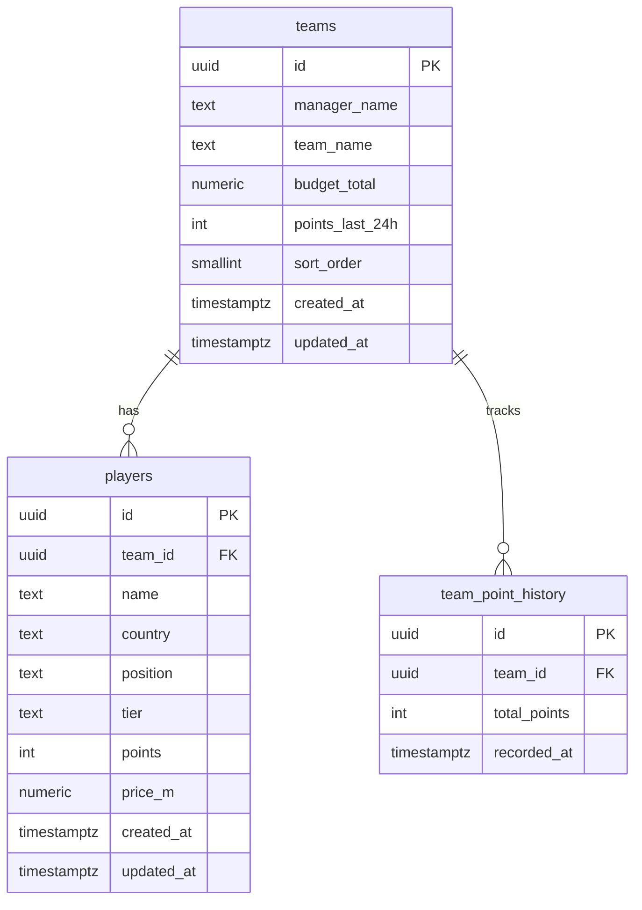

# WC26 Fantasy Auction — Database (Supabase)

Complete reference for PostgreSQL schema, security, app mapping, and how to manage league data. **No seed data is required or provided** — you create teams and players yourself.

---

## Overview

| Item | Detail |
|------|--------|
| **Provider** | [Supabase](https://supabase.com) (hosted PostgreSQL) |
| **Schema** | `public` |
| **Migration file** | `supabase/migrations/001_initial_schema.sql` |
| **Client access** | Anon key, **SELECT only** (RLS) |
| **Seeding** | **Not used** — do not rely on `supabase/seed.sql` for production |

---

## Setup checklist

1. Create a Supabase project.
2. Run `supabase/migrations/001_initial_schema.sql` in **SQL Editor → New query → Run**.
3. Copy **Project URL** and **anon public** key into `.env`:

```env
NEXT_PUBLIC_SUPABASE_URL=https://xxxxxxxx.supabase.co
NEXT_PUBLIC_SUPABASE_ANON_KEY=your-anon-public-key
```

4. Add rows to `teams`, then `players` (see [Managing data](#managing-data)).
5. Restart `npm run dev`.

---

## Entity relationship



---

## Tables

### `public.teams`

Franchises / managers in the league.

| Column | Type | Nullable | Default | Description |
|--------|------|----------|---------|-------------|
| `id` | `uuid` | NO | `gen_random_uuid()` | Primary key; exposed as `Manager.id` in app |
| `manager_name` | `text` | NO | — | Human manager name → `Manager.name` |
| `team_name` | `text` | NO | — | Franchise name → `Manager.teamName` |
| `budget_total` | `numeric(10,2)` | NO | `200` | Auction purse cap in **millions** → `Manager.budgetTotal` |
| `points_last_24h` | `integer` | NO | `0` | Recent delta for “Sync Flow” column → `Manager.pointsLast24h` |
| `sort_order` | `smallint` | NO | `0` | Display order on Franchises tab (1–8 recommended) |
| `created_at` | `timestamptz` | NO | `now()` | Audit |
| `updated_at` | `timestamptz` | NO | `now()` | Auto-updated by trigger |

**Indexes**

- `teams_sort_order_idx` on `(sort_order)`

---

### `public.players`

Roster players assigned to one team.

| Column | Type | Nullable | Default | Description |
|--------|------|----------|---------|-------------|
| `id` | `uuid` | NO | `gen_random_uuid()` | Primary key → `Player.id` |
| `team_id` | `uuid` | NO | — | FK → `teams.id` **ON DELETE CASCADE** |
| `name` | `text` | NO | — | Player display name |
| `country` | `text` | NO | — | Short code or label (e.g. `ARG`) |
| `position` | `text` | NO | — | **Check:** `GK`, `DEF`, `MID`, `FWD` only |
| `tier` | `text` | NO | — | **Check:** `gold`, `silver`, `bronze` only |
| `points` | `integer` | NO | `0` | Fantasy yield / portfolio points |
| `price_m` | `numeric(10,2)` | YES | `NULL` | Auction price paid in **millions** → `Player.price` |
| `created_at` | `timestamptz` | NO | `now()` | Audit |
| `updated_at` | `timestamptz` | NO | `now()` | Auto-updated by trigger |

**Indexes**

- `players_team_id_idx` on `(team_id)`

**App rule (not enforced in DB):** Target roster size is **30** per team (`SQUAD_SIZE` in app config).

---

### `public.team_point_history`

Optional time series for standings sparklines.

| Column | Type | Nullable | Default | Description |
|--------|------|----------|---------|-------------|
| `id` | `uuid` | NO | `gen_random_uuid()` | Primary key |
| `team_id` | `uuid` | NO | — | FK → `teams.id` **ON DELETE CASCADE** |
| `total_points` | `integer` | NO | — | Snapshot of team total at `recorded_at` |
| `recorded_at` | `timestamptz` | NO | `now()` | When snapshot was taken |

**Indexes**

- `team_point_history_team_recorded_idx` on `(team_id, recorded_at DESC)`

**App mapping:** Rows sorted by `recorded_at` ascending → `Manager.history` (padded to at least 7 points, max 15).

---

## Triggers & functions

### `public.set_updated_at()`

- **Type:** `BEFORE UPDATE` trigger function
- Sets `NEW.updated_at = now()` on `teams` and `players`

| Trigger | Table |
|---------|-------|
| `teams_updated_at` | `teams` |
| `players_updated_at` | `players` |

---

## Row Level Security (RLS)

RLS is **enabled** on all three tables.

| Policy | Table | Operation | Roles | Rule |
|--------|-------|-----------|-------|------|
| `teams_select_anon` | `teams` | `SELECT` | `anon`, `authenticated` | `USING (true)` |
| `teams_insert_anon` | `teams` | `INSERT` | `anon`, `authenticated` | `WITH CHECK (true)` — migration **002** |
| `players_select_anon` | `players` | `SELECT` | `anon`, `authenticated` | `USING (true)` |
| `team_point_history_select_anon` | `team_point_history` | `SELECT` | `anon`, `authenticated` | `USING (true)` |

**Implications**

- The browser app can **read** all rows with the anon key.
- The browser app can **insert teams** via Admin when migration **002** is applied.
- Player/history writes still require Dashboard SQL or future admin policies.

---

## Migrations

| File | Purpose |
|------|---------|
| `001_initial_schema.sql` | Tables, indexes, triggers, read RLS |
| `002_teams_admin_insert.sql` | `teams_insert_anon` — required for **Admin → Add team** |

Run both in Supabase **SQL Editor** (in order).

**Security note:** `002` allows anyone with the anon key to insert teams. Acceptable for private/dev; add auth before a public launch.

---

## App query (what the frontend runs)

Single nested select from `src/lib/db/league-repository.ts`:

```sql
-- Logical equivalent (PostgREST / Supabase client)
SELECT
  teams.id,
  teams.manager_name,
  teams.team_name,
  teams.budget_total,
  teams.points_last_24h,
  teams.sort_order,
  players (...),
  team_point_history (total_points, recorded_at)
FROM teams
ORDER BY sort_order ASC;
```

Supabase client:

```ts
supabase.from('teams').select(`...`).order('sort_order', { ascending: true })
```

---

## DB → application field mapping

### `teams` → `Manager`

| DB column | App field | Notes |
|-----------|-----------|-------|
| `id` | `id` | UUID string |
| `manager_name` | `name` | |
| `team_name` | `teamName` | |
| `budget_total` | `budgetTotal` | `Number()` cast |
| `points_last_24h` | `pointsLast24h` | |
| `players[]` | `roster` | Mapped per row |
| `players[].points` sum | `totalPoints` | **Not stored on team row** |
| `players[].length` | `squadCount` | **Computed** |
| `team_point_history[]` | `history` | Padded/sliced in mapper |
| — | `topAsset` | Best player by points; gold tier preferred |

### `players` → `Player`

| DB column | App field |
|-----------|-----------|
| `id` | `id` |
| `name` | `name` |
| `country` | `country` |
| `position` | `position` |
| `tier` | `tier` |
| `points` | `points` |
| `price_m` | `price` (optional) |

---

## Managing data

### 1. Create a franchise (team)

**Table Editor → `teams` → Insert row**

| Field | Example |
|-------|---------|
| `manager_name` | `Alex Mercer` |
| `team_name` | `Neon Galacticos` |
| `sort_order` | `1` |
| `budget_total` | `200` |
| `points_last_24h` | `0` |

Copy the generated `id` (UUID) for linking players.

**SQL:**

```sql
insert into public.teams (manager_name, team_name, sort_order, budget_total)
values ('Alex Mercer', 'Neon Galacticos', 1, 200)
returning id;
```

Repeat until you have up to **8** teams (`sort_order` 1–8).

---

### 2. Add a player to a team

**Table Editor → `players` → Insert row**

| Field | Example |
|-------|---------|
| `team_id` | `<uuid from teams>` |
| `name` | `Lionel Messi` |
| `country` | `ARG` |
| `position` | `FWD` |
| `tier` | `gold` |
| `points` | `0` |
| `price_m` | `12.5` or `NULL` |

**SQL:**

```sql
insert into public.players (team_id, name, country, position, tier, points, price_m)
values (
  '00000000-0000-0000-0000-000000000000',  -- replace with real team id
  'Lionel Messi',
  'ARG',
  'FWD',
  'gold',
  0,
  12.5
);
```

**Valid enums**

- `position`: `GK`, `DEF`, `MID`, `FWD`
- `tier`: `gold`, `silver`, `bronze`

Invalid values will fail the `CHECK` constraint.

---

### 3. Record standings history (optional)

For sparklines in Standings:

```sql
insert into public.team_point_history (team_id, total_points)
values ('<team-uuid>', 42);
```

Insert multiple rows over time; the app shows the last 15 snapshots (minimum 7 chart points with zero padding).

---

### 4. Update points / sync flow

```sql
-- Single player
update public.players
set points = 15
where id = '<player-uuid>';

-- Team “last 24h” label (manual until automated)
update public.teams
set points_last_24h = 8
where id = '<team-uuid>';
```

After changes, click **Reload League** in the app or refresh the page.

---

## Budget semantics (app-side)

The database stores `budget_total` and per-player `price_m`. Remaining budget in the Auction tab is calculated in `src/lib/budget.ts`:

| Condition | Formula |
|-----------|---------|
| Any player has `price_m` set | `budget_total - SUM(price_m)` |
| No prices recorded | `budget_total - (player_count × 12.5)` |

`12.5` is a placeholder slot cost (millions), not a DB column.

---

## Deleting data

| Action | Effect |
|--------|--------|
| Delete `teams` row | **Cascades** — all `players` and `team_point_history` for that team are deleted |
| Delete `players` row | Only that player removed |

---

## Full migration SQL

Run once in Supabase SQL Editor. Source of truth: `supabase/migrations/001_initial_schema.sql`.

Creates:

- Tables: `teams`, `players`, `team_point_history`
- Indexes (see above)
- Function `set_updated_at` + triggers
- RLS policies (read-only for anon/authenticated)

**Do not run seed scripts** unless you want throwaway test rows — production data should be entered manually or via a future admin tool.

---

## Troubleshooting

| Symptom | Likely cause | Fix |
|---------|--------------|-----|
| “Add NEXT_PUBLIC_SUPABASE…” | Empty env | Fill both vars in `.env.local` or Vercel |
| Supabase error in UI | RLS, wrong key, or schema not applied | Re-run migration; verify anon key |
| “No franchises yet” | Zero rows in `teams` | Insert teams |
| Empty roster in drawer | No `players` for that `team_id` | Insert players with correct FK |
| Admin insert blocked | Migration 002 not run | Run `002_teams_admin_insert.sql` |
| Player insert fails | Invalid `team_id` | Use UUID from `teams.id` |

**Verify in SQL:**

```sql
select t.team_name, count(p.id) as player_count
from public.teams t
left join public.players p on p.team_id = t.id
group by t.id, t.team_name
order by t.sort_order;
```

---

## Future schema (not implemented)

Planned when auction is built for real:

| Table | Purpose |
|-------|---------|
| `auction_sessions` | Draft night / phase |
| `auction_lots` | Player on the block, base price, status |
| `bids` | Team, amount, timestamp |
| `transactions` | Sold price → update `players.price_m` |

These tables do not exist yet. Document them here when added.

---

## File reference

| Path | Role |
|------|------|
| `supabase/migrations/001_initial_schema.sql` | Authoritative DDL |
| `src/lib/supabase/client.ts` | Browser client |
| `src/lib/supabase/types.ts` | TypeScript row types |
| `src/lib/db/league-repository.ts` | `fetchLeague()` |
| `src/lib/db/mappers.ts` | Row → `Manager` / `Player` |
| `.env.local` | `NEXT_PUBLIC_SUPABASE_URL`, `NEXT_PUBLIC_SUPABASE_ANON_KEY` |

---

## Related documentation

- **[APP-STRUCTURE.md](./APP-STRUCTURE.md)** — Frontend architecture, components, views, and extension points.
